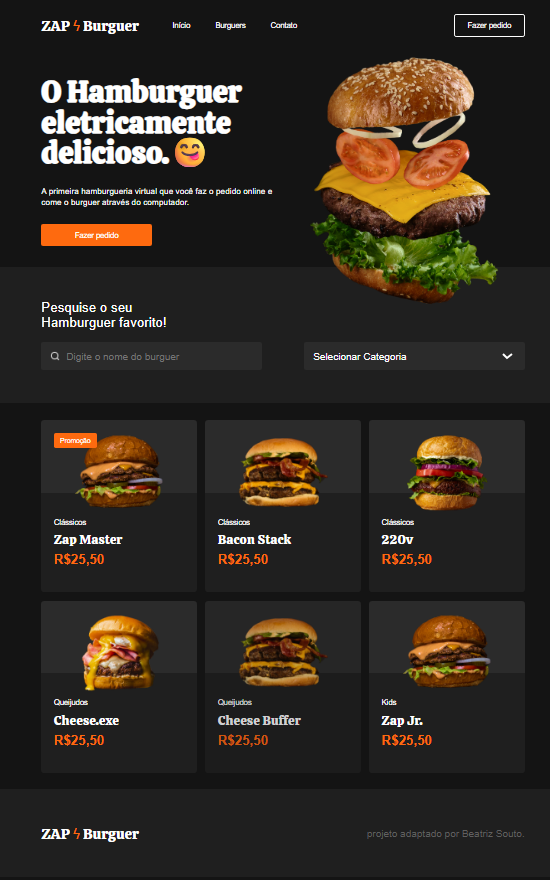

# 🍔 ZAP Burguer

### *Projetinho de fixação*

Uma Landing Page responsiva desenvolvida para uma hamburgueria virtual fictícia. Este projeto foi criado como forma de estudo para fixar conceitos fundamentais de **HTML5** e **CSS3**, adaptando uma ideia de layout existente.

### *Preview do Porjeto*


## 💻 Sobre o Projeto

O **ZAP Burguer** é uma página estática que simula o site de uma lanchonete moderna. O objetivo principal do desenvolvimento foi praticar a estruturação semântica e técnicas de estilização avançada sem o uso de frameworks.

### Principais Funcionalidades:
- **Layout Responsivo:** Adaptação para Desktop, Tablets (max-width: 820px) e Mobile (max-width: 500px).
- **Menu de Navegação:** Header com logo, links de navegação e botão de ação.
- **Hero Section:** Apresentação com chamada para ação (CTA).
- **Vitrine de Produtos:** Uso de **CSS Grid** para organizar os hambúrgueres.
- **Barra de Pesquisa:** Campos de input e select estilizados.

## 🛠 Tecnologias Utilizadas

* **HTML5:** Estrutura semântica (tags `header`, `nav`, `section`, `main`, `footer`).
* **CSS3:**
    * **Flexbox:** Para alinhamentos do menu, header e search bar.
    * **CSS Grid:** Para a galeria de produtos (`.products-grid`).
    * **Media Queries:** Para responsividade.
    * **Variáveis e Importações:** Uso de fontes do Google Fonts (Calistoga e Inter).

## 📂 Estrutura de Arquivos

A organização do projeto segue a seguinte estrutura:

```text
PROJETO_ZAPBURGUER
├── 📂 assets
│   ├── 📂 burgers  
│   ├── heroBurger.png 
│   ├── searchIcon.png 
│   └── style.css
│   └── projeto_preview.png
└── index.html
```

## 👤 Desenvolvedor

Este projeto foi adaptado por [**Beatriz Souto**](https://github.com/beatrizsouto3) com objetivos de estudar e fixar conhecimentos de HTML e CSS.